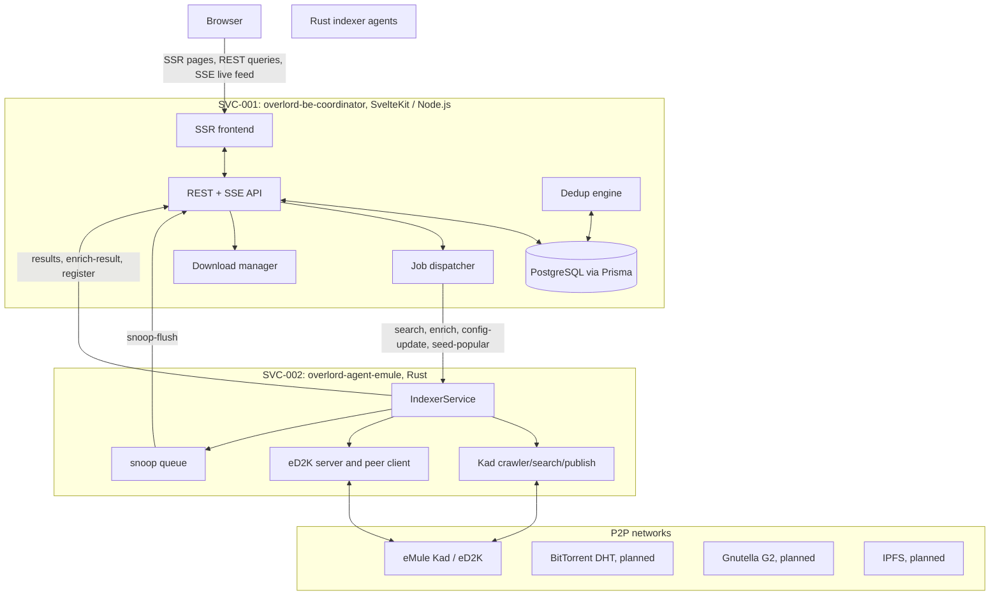

# p2p-overlord

`p2p-overlord` is a multi-protocol P2P metadata indexer, protocol-parity lab,
and coordinator. It combines Rust wire-protocol agents, a SvelteKit/Node
coordinator, PostgreSQL storage, and reproducible parity tooling to harvest,
normalize, and deduplicate file metadata from peer-to-peer networks.

The current implementation is concentrated on eMule Kad/eD2K. That work is not
just a sketch: the workspace already contains a native Rust eMule agent, a live
coordinator, deterministic eMule harness scenarios, real-network confidence
cells, local file ingest, shared-catalog support, native download/upload paths,
queue/resume/callback coverage, modern AICH/hashset handling, and a growing
stock-wire parity matrix.

The broader target is one coordinator with specialized protocol agents for Kad,
eD2K, BitTorrent DHT, Gnutella G2, and IPFS. Today the release focus is the
Kad/eD2K RC1.

## Why This Exists

P2P networks still contain useful, decentralized metadata, but each network
speaks a different protocol and exposes different evidence about the same file.
`p2p-overlord` is built to make that data operational:

- crawl and search live networks through protocol-native agents;
- collapse the same file across protocols into one canonical record;
- preserve per-network sources, hashes, tags, names, and observations;
- prove protocol behavior with deterministic and live parity scenarios;
- keep protocol work close to stock peer behavior where interoperability depends
  on it.

This is both an indexer and a serious compatibility effort.

## What Is Already Built

| Area | Current capability |
|---|---|
| Rust eMule agent | One runtime agent for Kad and eD2K, with shared service contracts, runtime config, stats, search, enrichment/download, local ingest, and seed-publish entry points. |
| Kad | Startup, routing, bootstrap, keyword/source/notes search, keyword/source/notes publish, sender-key/ack handling, obfuscated and plaintext live keyword evidence, and deterministic harness coverage. |
| eD2K server path | Server login, capability negotiation, server list handling, keyword search, source search, background source search, UDP source search, offer-files, large-file size tags, and same-server source-discovery instrumentation. |
| eD2K peer path | Client hello, secure-ident handling, HASHSET2/FileIdentifier flows, compressed part transfer, native download, listener upload, resume, queue ranking, callback-issued source acquisition, plaintext and obfuscated transport coverage. |
| File sharing | Local file ingest, MD4/AICH generation, completed transfer manifests, verified shared catalog entries, re-offer of completed files, and serving from verified local payloads. |
| Hashing and AICH | ED2K MD4 part hashsets, modern AICH root/part trees, validation, persistence, local generation, and large-file AICH closure scenarios. |
| Coordinator | SvelteKit/Node coordinator, REST/SSE surfaces, agent registration, job dispatch, search store, Prisma/PostgreSQL schema ownership, dedup-oriented file records, and local DB helper. |
| Tooling | Versioned scenario manifests, campaign inventory, deterministic eMule harness runners, real-network runners, parity summaries, source-size guards, line-ending guards, tracked-file privacy guards, and workspace quality automation. |

## Current RC1 Focus

The near-term target is `p2p-overlord` `0.1.1-rc.1` with full Kad/eD2K support
for file sharing and downloading. The active work is narrow and concrete:

- close the large-file eD2K AICH real-network cell by fixing same-server live
  source discovery;
- align the coordinator API with the agent so eD2K keyword, source, and notes
  jobs are all reachable through the public product path;
- finish or truthfully de-advertise eD2K preview and shared-files/shared-directory
  browsing surfaces;
- complete LowID callback/buddy state transitions and broader downloader
  scheduling behavior;
- add more Kad live confidence for source/notes/publish acceptance;
- keep upload queue behavior stock-like where peers can observe it.

Durable eD2K credit accounting is intentionally not an RC1 gate. Peer-visible
queue rank, LowID behavior, slot promotion, callback handling, and truthful
capability adverts still matter.

For the working RC1 checklist, see
[docs/RC1_PARITY_EXECUTION_PLAN.md](docs/RC1_PARITY_EXECUTION_PLAN.md).
For version, branch, tag, and GitHub milestone rules, see
[docs/RELEASE_POLICY.md](docs/RELEASE_POLICY.md).

## Evidence, Not Handwaving

The project keeps protocol claims tied to executable scenario manifests. The
current matrix includes:

- `ed2k.campaign.downloader-startup.v1`
- `ed2k.campaign.source-acquisition.v1`
- `ed2k.campaign.listener-serving.v1`
- `ed2k.campaign.queue-and-slot.v1`
- `ed2k.campaign.resume.v1`
- `ed2k.campaign.callback.v1`
- `ed2k.campaign.surface.v1`
- `ed2k.campaign.modern-aich.v1`
- `ed2k.campaign.realnet-confidence.v1`
- `kad2.campaign.private-confidence.v1`
- `kad2.campaign.publish-families.v1`
- `kad2.campaign.search-families.private.v1`
- `kad2.campaign.realnet-confidence.v1`
- `kad2.campaign.routing-and-transport.v1`

Private cells run against deterministic harnesses. Live cells are explicitly
marked and require the workspace live-network prerequisites.

Useful inspection commands from `../p2p-overlord-tooling`:

```console
python -m overlord_tooling show-parity-matrix --availability available --protocol ed2k
python -m overlord_tooling show-parity-matrix --availability available --protocol kad2
python -m pytest tests/e2e/test_manifests.py tests/e2e/test_scenario_catalog.py -q
```

## Repository Map

This repo is the backend/coordinator repo. The p2p-overlord workspace is split
across three active repositories:

| Repository | Role |
|---|---|
| `p2p-overlord-be` | Coordinator, public/backend API, SSR UI, Prisma schema, PostgreSQL helper, product docs. |
| `p2p-overlord-agents` | Rust protocol agents and protocol crates. Current runtime agent: `overlord-agent-emule`. |
| `p2p-overlord-tooling` | Scenario manifests, parity runners, harness orchestration, reports, and workspace quality guards. |

Current in-tree backend surfaces:

| Surface | Kind | Status | Notes |
|---|---|---|---|
| `overlord-be-coordinator` | Node package | current | SvelteKit coordinator, API, SSR UI, Prisma schema owner. |
| `overlord-be-db` | Ops helper | current | Windows local PostgreSQL bootstrap/runtime helper for backend development. |

## Architecture



## Service Roadmap

| ID | Package | Status | Default port | P2P surface |
|---|---|---|---|---|
| SVC-001 | `overlord-be-coordinator` | current | 13300 | Coordinator/API/UI |
| SVC-002 | `overlord-agent-emule` | current | 13301 | Kad UDP, eD2K TCP |
| SVC-003 | `overlord-agent-mainline` | planned | 13302 | BitTorrent DHT |
| SVC-004 | `overlord-agent-gnutella` | planned | 13303 | Gnutella G2 |
| SVC-005 | `overlord-agent-ipfs` | planned | 13304 | IPFS/libp2p |

All ports are configurable. See [docs/CONFIGURATION.md](docs/CONFIGURATION.md)
for backend configuration and the
[agent protocol docs](https://github.com/emulebb/p2p-overlord-agents/tree/develop/docs)
for protocol details.

## Backend Development

Primary backend package:

```console
cd overlord-be-coordinator
npm install
npm run prisma:generate
npm run prisma:validate
npm run check
```

Useful workspace checks from `../p2p-overlord-tooling`:

```console
python -m overlord_tooling guard-tracked-files --repo-root ../p2p-overlord-be
python -m overlord_tooling guard-line-endings --repo-root ../p2p-overlord-be
python -m overlord_tooling quality-baseline
```

For persisted schema edits, backend checks are not enough by themselves. Reset
and rebuild the local database through `overlord-be-db`, then confirm the live
schema still matches the canonical Prisma naming.

## Docs

- [Backend docs](docs/README.md)
- [Architecture](docs/ARCHITECTURE.md)
- [Coordinator](docs/COORDINATOR.md)
- [Configuration](docs/CONFIGURATION.md)
- [Roadmap](docs/ROADMAP.md)
- [RC1 parity execution plan](docs/RC1_PARITY_EXECUTION_PLAN.md)
- [Release policy](docs/RELEASE_POLICY.md)
- [Active backlog](BACKLOG.md)
- [Agent protocol docs](https://github.com/emulebb/p2p-overlord-agents/tree/develop/docs)
- [Tooling docs](https://github.com/emulebb/p2p-overlord-tooling/tree/develop/docs)

## eMuleBB Product-Family Contracts

This repo lives under `https://github.com/emulebb/p2p-overlord-be`. The
coordinator owns its internal REST/SSE API, but any eMuleBB-compatible `/api/v1`
surface must prove its claimed subset against
`repos/emulebb-tooling/docs/rest/REST-API-OPENAPI.yaml`.

Deterministic eD2K server scenarios should use the eMuleBB `goed2k-server` fork.
Historical p2p-overlord eD2K server lineage is reference material only.
